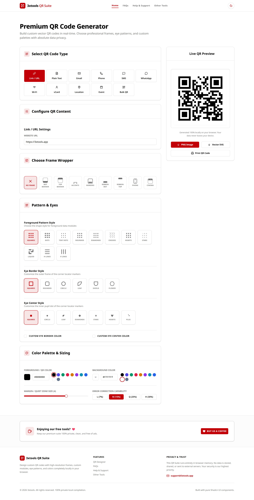
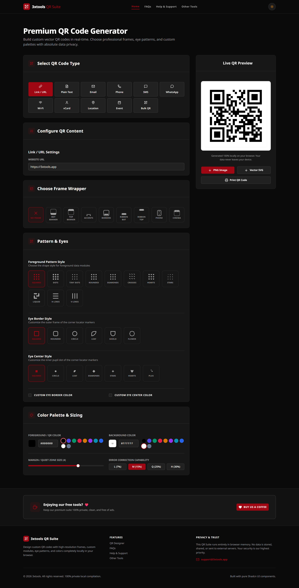

# 3XTOOLS QR Code Generator 📱✨

A high-performance, 100% client-side QR Code Designer & Bulk Batch Exporter. Built with React 19, Vite, TailwindCSS, pure Shadcn UI components, and HTML5 Canvas API.

All compiling and rendering execute locally inside browser memory — zero server uploads, zero tracking, and zero royalties.

---

## 📸 Real Application Screenshots

### QR Code Designer Workspace (Light Mode)


### QR Code Designer Workspace (Dark Mode)


### Bulk QR Batch Exporter


---

## ✨ Features & Capabilities

| Feature | Description |
|---------|-------------|
| **🔗 7 QR Code Types** | Generate QR codes for Website URLs, Plain Text, Email (To, Subject, Body), Phone Calls, SMS Messages, WhatsApp Direct Chat, and Wi-Fi Access Points (WPA/WPA2/WEP/Open). |
| **🎨 Custom Module Patterns** | Choose from 10+ module shapes including Squares, Dots, Small Dots, Rounded, Diamonds, Hearts, Stars, Liquid, Horizontal Lines, and Vertical Lines. |
| **👁️ Eye Border & Pupil Customization** | Customize outer locator borders (Squares, Rounded, Circle, Leaf, Shield, Flower) and inner pupils (Dots, Leaves, Diamonds, Hearts, Stars, Plus). |
| **🖼️ Frame Wrappers** | Wrap QR codes with custom CTA banners ("SCAN ME", "CONNECT WI-FI", "DRINK & ENJOY"), bottom accents, ribbon frames, clapperboards, or smartphone mockups with custom font styles & colors. |
| **🎨 Color Palette Controls** | Full background & foreground custom ColorPicker swatches with independent eye border & pupil color controls. |
| **📦 Bulk Batch Generation** | Upload `.csv` files or paste data line-by-line. Map payload data and custom filenames, render batch previews, and download all generated QR codes as a `.zip` archive. |
| **💾 Export Formats** | High-resolution PNG image download & loss-free vector SVG export. |

---

## 🛡️ Privacy & Security Architecture

- **100% Client-Side**: No backend API server or cloud upload required.
- **Offline Capable**: Works completely offline once loaded.
- **Zero Data Collection**: No cookies, tracking scripts, or external analytics.

---

## 🛠️ Tech Stack & Design System

- **Framework**: React 19 + Vite 8
- **UI Components**: Pure Shadcn UI (`Button`, `Card`, `Input`, `Select`, `Badge`, `Progress`, `Checkbox`, `Dialog`, `Slider`, `Separator`, `Tooltip`)
- **Styling**: Tailwind CSS v4 + Vanilla CSS Design Tokens
- **QR Engine**: `qrcode` (Payload matrix calculation) + Canvas API (Vector & pixel rendering)
- **Archive Engine**: `jszip` (Bulk batch packaging)
- **Icons**: Lucide React

---

## 🚀 Getting Started

### Prerequisites

- Node.js 18+
- npm or pnpm

### Installation

```bash
# Clone repository
git clone https://github.com/your-username/qr-code-generator.git

# Navigate to project directory
cd "qr code generator"

# Install dependencies
npm install

# Start local dev server
npm run dev
```

### Build for Production

```bash
npm run build
```

---

## 📄 License

MIT License © 2026 3XTOOLS.
